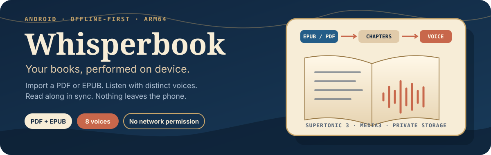
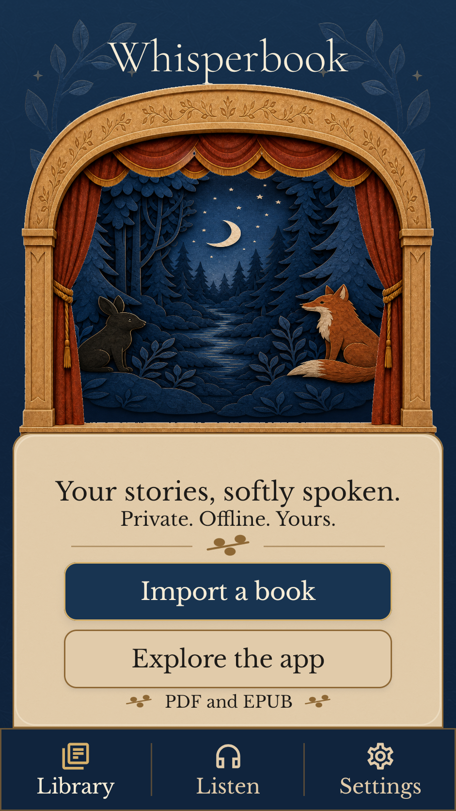
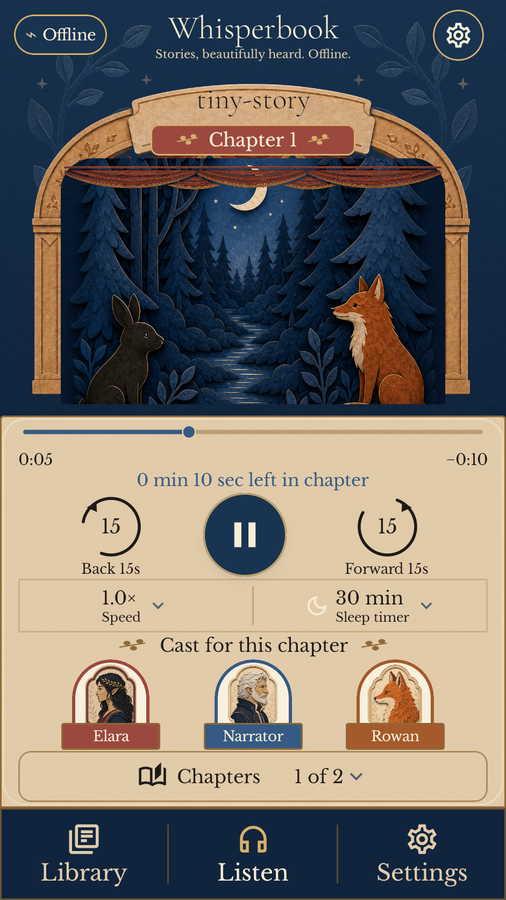
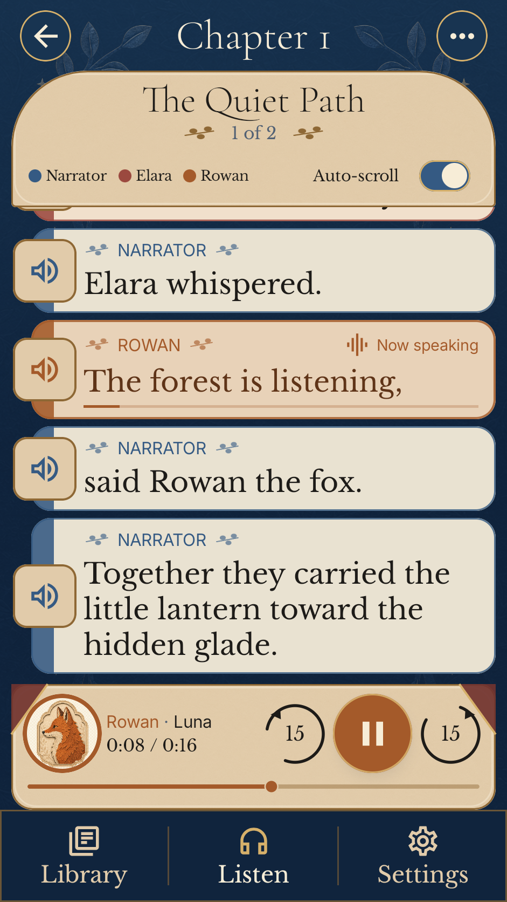
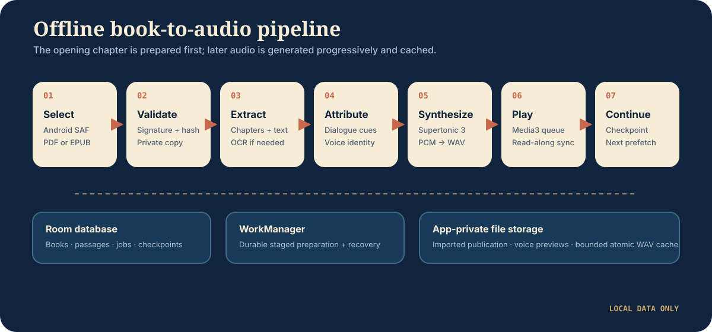
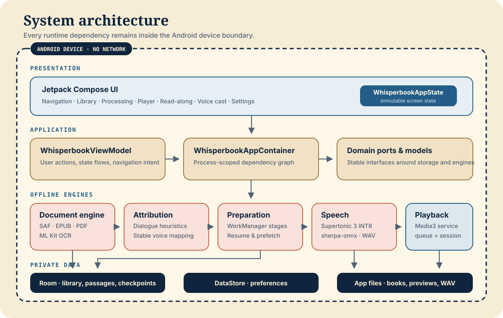

<p align="center">
  
</p>

<p align="center">
  <strong>Android 8.0+</strong> · <strong>arm64</strong> · <strong>offline runtime</strong> · <strong>no account</strong> · <strong>no cloud upload</strong>
</p>

Whisperbook is an offline-first Android reader that converts a local EPUB or PDF into a chapter-based audiobook. It extracts text, identifies dialogue, assigns stable character voices, synthesizes speech, and keeps the visible passage synchronized with playback—without sending the book off the device.

> [!IMPORTANT]
> The app runtime deliberately has no `INTERNET` or `ACCESS_NETWORK_STATE` permission. A first development build still needs network access to resolve Gradle dependencies.

## See it working

<p align="center">
  
  &nbsp;
  
  &nbsp;
  
</p>

These are captured emulator builds, not design mockups. The full screen inventory lives in the [implementation map](design-system/IMPLEMENTATION_MAP.md).

## What it does

| Capability | Implementation |
| --- | --- |
| Private import | Android Storage Access Framework, byte-signature validation, SHA-256 duplicate detection, and an app-private source copy |
| Publication extraction | EPUB metadata/reading-order parsing, PDF text extraction, and bundled ML Kit OCR for image-only pages |
| Character voices | Explainable dialogue heuristics, first-person narrator detection, confidence-bearing age/gender cues, profile-aware casting across eight embedded Supertonic 3 voices, and per-character overrides |
| Durable preparation | A staged WorkManager pipeline with persisted progress, restart recovery, chapter-scoped character discovery, opening-audio priority, and sequential prefetch |
| Local audio | sherpa-onnx inference, 44.1 kHz WAV output, atomic writes, cache validation, retention, and bounded cleanup |
| Playback | Media3 foreground service, chapter queueing, automatic continuation, 15-second seek, speed control, sleep timer, and audio-focus handling |
| Read-along | Active-passage tracking, speaker labels and portraits, live progress, optional auto-scroll, and playback checkpoints |
| Privacy | No runtime networking permission, no accounts, no analytics, no cloud fallback, and Android backup/transfer disabled |

## How a book becomes audio

<p align="center">
  
</p>

The opening chapter is attributed, cast, and streamed first, so listening can start without scanning every chapter for characters. Later chapters are analyzed and generated sequentially. A versioned `characters.json` mirror in app-private storage records each completed chapter's character contribution for restart-safe, idempotent progress; Room remains authoritative for characters and voice choices. The editable diagrams.net source is [offline-pipeline.drawio](docs/architecture/diagrams/offline-pipeline.drawio).

## Architecture

<p align="center">
  
</p>

The application uses one Android module with package boundaries for presentation, orchestration, domain contracts, processing engines, persistence, and playback. `WhisperbookAppContainer` is the process-scoped composition root; `WhisperbookViewModel` translates UI intent into repository, preparation, and playback operations.

Read the [architecture guide](docs/architecture/README.md) for responsibilities, dependency direction, runtime flows, storage boundaries, and change guidance. The editable diagrams.net source is [system-architecture.drawio](docs/architecture/diagrams/system-architecture.drawio).

## Repository map

```text
whisper-book/
├── app/
│   ├── schemas/                  Room schema history
│   └── src/
│       ├── main/
│       │   ├── assets/tts/       Bundled Supertonic 3 model
│       │   ├── java/.../data/    Room, DataStore, repositories
│       │   ├── java/.../domain/  Models and ports
│       │   ├── java/.../engine/  Import, extraction, attribution, TTS
│       │   ├── java/.../playback/Media3 service and queue
│       │   └── java/.../ui/      Compose screens and design system
│       ├── test/                 JVM tests
│       └── androidTest/          Device/emulator tests
├── art/                          Source art and emulator evidence
├── assets/readme/                README visual identity
├── design-system/                Approved screens and navigation map
├── docs/architecture/            Architecture guide and editable diagrams
├── docs/licenses/                Third-party artifact records
└── qa-fixtures/                  Deterministic EPUB test fixture
```

## Build and install

### Requirements

- JDK 17
- Android SDK 36 and build-tools 36
- An arm64 Android device or emulator running Android 8.0 / API 26 or newer

The TTS runtime and model are committed under `app/libs/` and `app/src/main/assets/tts/`; no separate model download is required.

```bash
./gradlew :app:assembleDebug
adb install -r app/build/outputs/apk/debug/app-debug.apk
```

Open the app, choose a readable `.epub` or `.pdf` in the Android document picker, and wait for the opening audio to finish preparing.

## Verification

Run the local quality gate:

```bash
./gradlew :app:testDebugUnitTest :app:lintDebug :app:assembleRelease
```

Run connected tests with an arm64 device or emulator available:

```bash
./gradlew connectedDebugAndroidTest
```

JVM tests cover document parsing, attribution, persistence mapping, cache behavior, WAV generation, preparation, ViewModel actions, settings, navigation contracts, and playback utilities. Connected tests exercise real model loading/synthesis, Android EPUB/PDF extraction, local OCR, Compose semantics, navigation, voice preview, library persistence, and chapter continuation.

CI runs unit tests, lint, and an unsigned release build on every push and pull request.

## Release builds

Release builds are minified and resource-shrunk. Provide all four signing values to generate a signed artifact:

```bash
export WHISPERBOOK_KEYSTORE_PATH=/absolute/path/to/release.jks
export WHISPERBOOK_KEYSTORE_PASSWORD='...'
export WHISPERBOOK_KEY_ALIAS='...'
export WHISPERBOOK_KEY_PASSWORD='...'
./gradlew :app:bundleRelease
```

Without these variables, Gradle intentionally creates an unsigned release artifact. Keystores and signing secrets are ignored by Git.

## Supported input and boundaries

- EPUB and PDF are supported; corrupt, encrypted, password-protected, and DRM-protected publications are rejected.
- Image-only PDF pages use bundled on-device OCR. Pages with no recognizable text remain an import error; there is no cloud fallback.
- The current native runtime is packaged for `arm64-v8a` only.
- Large books are prepared progressively; they are not fully synthesized before playback starts.
- Age, gender, and first-person identity detection is a conservative English-language heuristic. Ambiguous or conflicting evidence stays unknown and uses the normal automatic/default voice; users can always override the cast.
- Imported sources, extracted content, generated audio, settings, and checkpoints live in app-private storage. Uninstalling the app or clearing its data removes that private library, not the user's original external file.

## Project documents

- [Architecture](docs/architecture/README.md) — component responsibilities, flows, boundaries, and editable diagrams
- [Product contract](PRODUCT.md) — product goals, non-goals, and acceptance criteria
- [Design system](DESIGN.md) — Woodland Paper Theatre principles and UI tokens
- [Implementation map](design-system/IMPLEMENTATION_MAP.md) — screen-by-screen source and asset mapping
- [Privacy](PRIVACY.md) — on-device data handling and permission policy
- [TTS artifacts](docs/licenses/TTS_ARTIFACTS.md) — bundled runtime/model provenance and checksums

## Licensing

Third-party runtimes, model assets, and fonts retain their own licenses under [docs/licenses](docs/licenses). This repository does not currently declare a top-level license for the Whisperbook application source; add one before distributing or accepting external contributions.
