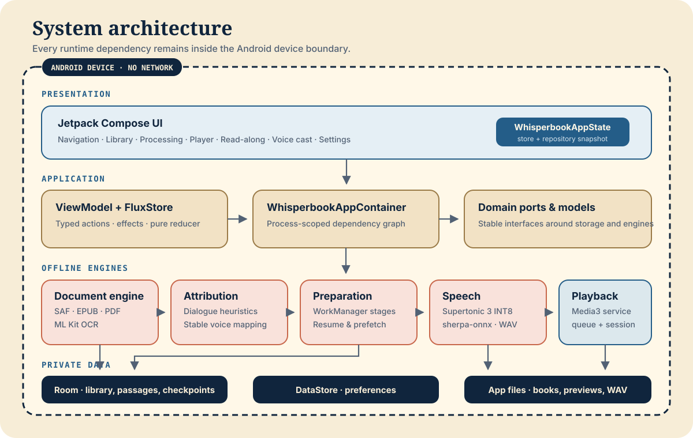
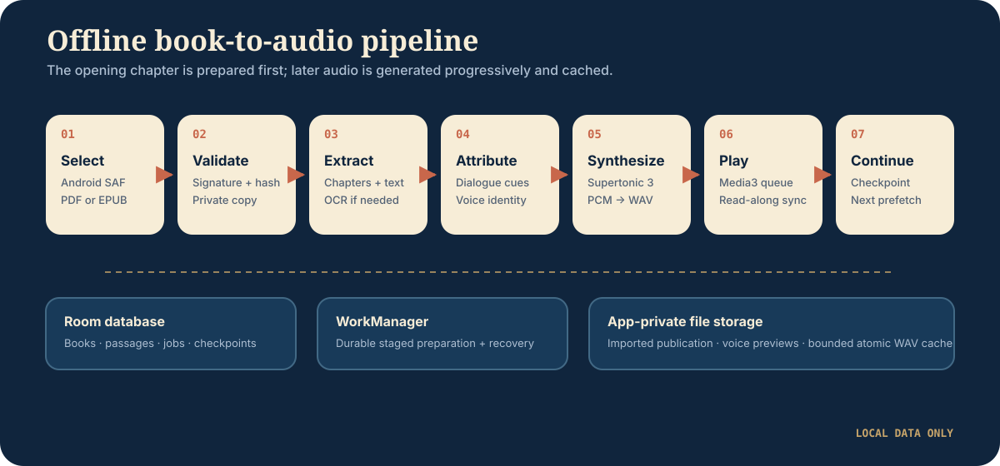

# Whisperbook architecture

Whisperbook is an offline-first Android application organized as a single Gradle module with explicit package boundaries. The architecture optimizes for three product invariants:

1. A selected book and every derived artifact remain on the device.
2. Playback can start after the opening audio is ready, without waiting for the whole book.
3. Background work, process recreation, and chapter transitions do not lose durable progress.

## System view



Editable diagrams.net source: [system-architecture.drawio](diagrams/system-architecture.drawio).

## Package responsibilities

| Package | Responsibility | Primary entry points |
| --- | --- | --- |
| `ui` | Compose screens, navigation, design tokens, accessibility semantics, and user-facing state | `WhisperbookApp`, `WhisperbookNavHost`, `WhisperbookAppState` |
| `integration` | UI orchestration and process-level dependency composition | `WhisperbookViewModel`, `WhisperbookAppContainer`, `WhisperbookServices` |
| `integration.flux` | Typed user actions, immutable transient app state, synchronous store, and pure reducer mutations | `WhisperbookAction`, `FluxStore`, `WhisperbookFluxState` |
| `domain` | Stable data models and ports used across storage, preparation, and playback | `Models.kt`, `Ports.kt` |
| `engine.document` | SAF import, byte-signature validation, EPUB parsing, PDF extraction, and offline OCR | `SafBookImporter`, `OfflinePublicationExtractor`, `AndroidPdfOcrHook` |
| `engine.attribution` | Dialogue scanning, speaker attribution, alias handling, first-person narration detection, and confidence-bearing character profiles | `DialogueScanner`, `HeuristicSpeakerAttributor`, `CharacterProfileInferencer` |
| `engine.metadata` | Atomic, versioned, app-private character discovery mirror with per-chapter contributions | `AppPrivateCharacterMetadataCatalog` |
| `engine.preparation` | Durable, staged background preparation and chapter prefetch | `ProductionPreparationCoordinator`, `PreparationWorker`, `SequentialChapterAudioPreparer` |
| `engine.tts` | Embedded model validation and local speech generation | `SherpaKittenTtsEngine`, `SupertonicAssets` |
| `engine.audio` | WAV persistence, cache keys, on-demand generation, and voice previews | `AppPrivateAudioSegmentStore`, `LocalAudioGenerationCoordinator`, `LocalVoicePreviewPlayer` |
| `data` | Room/DataStore persistence and repository implementations | `WhisperBookDatabase`, `RoomLibraryRepository`, `DataStoreSettingsRepository` |
| `playback` | Media3 service/session, queue construction, checkpoints, and sleep timer | `WhisperPlaybackService`, `ControllerBackedPlaybackGateway`, `PlaybackRuntime` |

`SherpaKittenTtsEngine` is a historical internal class name; the implementation and bundled assets use Supertonic 3.

## Dependency direction

The project does not enforce these boundaries with separate Gradle modules, so they are architectural rules rather than compiler-enforced rules:

```text
Compose UI
    ↓ typed WhisperbookAction
ViewModel effect dispatcher
    ├──→ domain ports → data, preparation, audio, and playback → Android platform
    └──→ WhisperbookMutation → pure reducer → FluxStore
                                                ↓
                     repository flows + immutable UI snapshot → Compose UI
```

- UI code should consume screen state and actions rather than open databases, files, or media sessions directly.
- Domain models should not depend on Compose, Room entities, WorkManager, or Media3 types.
- The app container is the composition root. Avoid constructing alternate process-scoped dependency graphs in screens or workers.
- Background workers resolve installed `PreparationDependencies` and persist checkpoints after each durable stage.
- Playback reads prepared segments through `PlaybackQueueSource`; it should not know how a publication was parsed or attributed.

## Flux application state

The presentation/application boundary uses a Flux-style unidirectional data flow:

1. Compose screens call `WhisperbookUiActions`, whose default wrappers create a typed `WhisperbookAction`.
2. `WhisperbookViewModel.dispatch()` is the effect boundary. It validates the intent and invokes domain ports; reducers never perform I/O or launch coroutines.
3. Synchronous results and asynchronous effect outcomes are expressed as `WhisperbookMutation` values.
4. `whisperbookReducer` produces a new immutable `WhisperbookFluxState`; `FluxStore` is the only owner of transient selection, loading, operation, scheduling-error, and refresh state.
5. Repository, DataStore, WorkManager, and Media3 flows remain durable sources of truth. The ViewModel combines those flows with the Flux store to expose one immutable `WhisperbookUiSnapshot` back to Compose.

Compatibility methods on `WhisperbookViewModel` remain available to focused orchestration tests, but production UI events enter through the typed dispatcher. New UI behavior should add an action and route side effects through the ViewModel instead of introducing another mutable state holder.

## Runtime flow



Editable diagrams.net source: [offline-pipeline.drawio](diagrams/offline-pipeline.drawio).

### Import and preparation

1. `SafBookImporter` reads the user-selected URI, validates the actual file signature, hashes the content, and creates an app-private copy.
2. `RoomLibraryRepository` persists the book record and prevents duplicate sources from becoming separate library entries.
3. `OfflinePublicationExtractor` parses EPUB/PDF structure on CPU. `AndroidPdfOcrHook` recognizes pages without a usable text layer through ML Kit, whose runtime owns hardware-delegate selection.
4. The preparation worker normalizes passages and detects chapter boundaries, then attributes, casts, and synthesizes one chapter at a time. Chapter 1 reaches audio before later chapters are scanned for characters.
5. Each committed chapter updates an atomic `characters.json` mirror with stable IDs, aliases, profiles, fingerprints, and idempotent per-chapter counts. Room remains the source of truth for playback and user voice choices.
6. Supertonic synthesis generates PCM on one low-priority inference lane. API 29+ requests ONNX Runtime's NNAPI provider first; unsupported partitions and failed accelerated sessions fall back to the ONNX Runtime CPU provider. A representative NNAPI utterance above the guarded real-time-factor limit moves later work to CPU for that process, because partial offload can be slower than optimized CPU. Older releases select CPU immediately.
7. `AppPrivateAudioSegmentStore` validates and atomically commits WAV files. Opening microsegments become playable first; remaining passages are generated sequentially rather than competing for compute in parallel.

### Playback and read-along

1. `ControllerBackedPlaybackGateway` connects the application layer to the Media3 session service.
2. `LocalPlaybackQueueSource` resolves cached segments and may coordinate missing local audio generation.
3. `WhisperPlaybackService` owns the player and foreground media session.
4. Media transitions update `PlaybackRuntime`; the installed checkpoint sink writes passage and chapter progress to Room.
5. UI state combines library data, current queue state, and checkpoints to highlight the active passage and continue across chapters.

## Persistence boundaries

| Store | Contents | Lifecycle |
| --- | --- | --- |
| Room | Books, chapters, passages, characters, voice assignments, audio metadata, preparation jobs, checkpoints | App-private; schema history is committed under `app/schemas/` |
| Character metadata JSON | Derived per-chapter discovery contributions and cumulative character profiles | `filesDir/publications/metadata/<sha256(bookId)>/characters.json`; atomic and deleted with the book |
| DataStore | Playback and presentation preferences | App-private |
| Imported source files | Private copies of user-selected EPUB/PDF files | Deleted with the library entry or app data; the external original is untouched |
| Audio cache | Synthesized segments and retained voice-change rollback audio | App-private, validated, bounded, and cleaned according to retention rules |
| Voice preview cache | Short generated samples for the embedded voice picker | App-private and invalidated by model version/sample-rate changes |

## Privacy and trust boundary

The Android manifest explicitly removes `INTERNET` and `ACCESS_NETWORK_STATE`, including declarations that could arrive through transitive manifests. Cleartext traffic is disabled, backup and device transfer are disabled, services are not exported, and selected documents are copied into private app storage.

Build tooling is outside this runtime boundary: Gradle may access configured artifact repositories while resolving dependencies. The installed app itself has no networking permission.

See [PRIVACY.md](../../PRIVACY.md) for the user-facing privacy contract.

## Concurrency and failure handling

- Speech inference is intentionally serialized to protect Compose and audio I/O responsiveness, including when an unsupported NNAPI partition or session falls back to CPU.
- Diagnostics report `nnapi`, `cpu`, `structural_cpu`, or `mlkit_ocr` without claiming which vendor GPU, DSP, or NPU an Android driver selected.
- WorkManager provides durable background execution, retry behavior, and foreground-service integration for preparation.
- Preparation stage progress is persisted, so work can resume after process recreation instead of starting from zero.
- WAV output uses temporary files plus validation and atomic promotion to avoid exposing partial audio.
- Cache keys include content, voice, speed, and model version so incompatible audio is regenerated.
- Chapter selection and queue handoff follow a latest-request-wins contract to prevent stale asynchronous queues replacing a newer choice.

## Safe change guide

| Change | Start here | Verify with |
| --- | --- | --- |
| Add a screen or route | `ui/navigation`, `ui/screens`, `WhisperbookUiState` | Navigation and Compose semantics tests |
| Change stored book data | `data/local/db`, mappers, repository | Room schema export, migration test, repository tests |
| Add a preparation stage | `PreparationWorker`, `ProductionPreparationCoordinator` | Stage-resume, retry, and notification tests |
| Change voice behavior | `engine/tts`, `engine/audio`, voice assignments | Model asset, PCM/WAV, preview, cache-key, and regeneration tests |
| Change playback sequencing | `integration/LocalPlaybackQueueSource`, `playback` | Queue, chapter continuation, checkpoint, audio-focus tests |
| Change import support | `engine/document`, repository | Signature, parser, OCR, encrypted/corrupt input tests |

## Diagram maintenance

The `.drawio` files are uncompressed diagrams.net XML and are the editable sources. Open them in [diagrams.net](https://app.diagrams.net/), keep existing cell IDs where practical, and export the matching SVG next to the source. README embeds point to the SVG exports so diagrams render directly on GitHub.

Whenever a boundary, dependency, or pipeline stage changes, update both the XML source and exported SVG in the same change.
